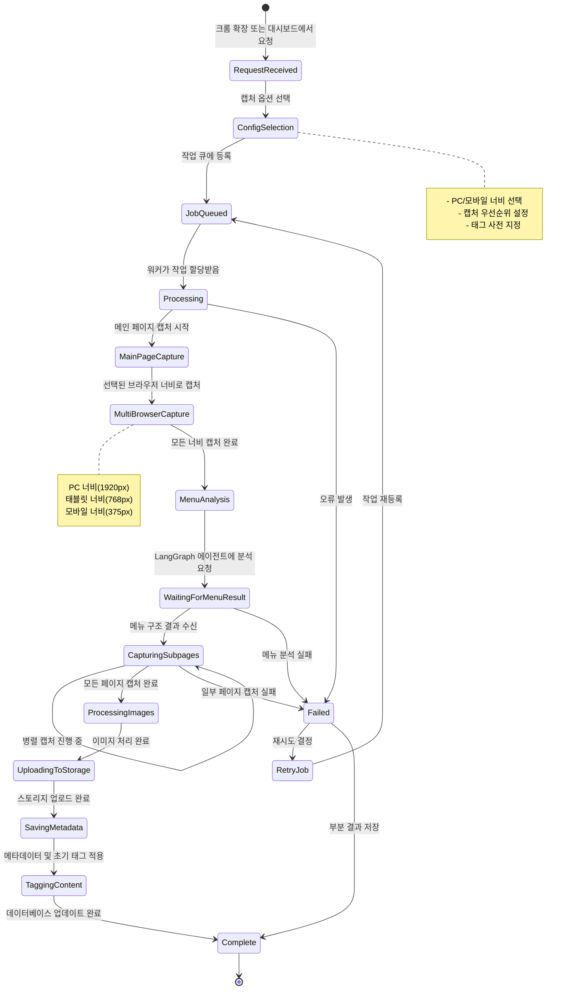

# 캡처 워크플로우

```mermaid
stateDiagram-v2
    [*] --> RequestReceived: 크롬 확장 또는 대시보드에서 요청
    RequestReceived --> ConfigSelection: 캡처 옵션 선택
    ConfigSelection --> JobQueued: 작업 큐에 등록

    note right of ConfigSelection
        - PC/모바일 너비 선택
        - 캡처 우선순위 설정
        - 태그 사전 지정
    end note

    JobQueued --> Processing: 워커가 작업 할당받음
    Processing --> MainPageCapture: 메인 페이지 캡처 시작

    MainPageCapture --> MultiBrowserCapture: 선택된 브라우저 너비로 캡처

    note right of MultiBrowserCapture
        PC 너비(1920px)
        태블릿 너비(768px)
        모바일 너비(375px)
    end note

    MultiBrowserCapture --> MenuAnalysis: 모든 너비 캡처 완료
    MenuAnalysis --> WaitingForMenuResult: LangGraph 에이전트에 분석 요청

    WaitingForMenuResult --> CapturingSubpages: 메뉴 구조 결과 수신
    CapturingSubpages --> CapturingSubpages: 병렬 캡처 진행 중

    CapturingSubpages --> ProcessingImages: 모든 페이지 캡처 완료
    ProcessingImages --> UploadingToStorage: 이미지 처리 완료

    UploadingToStorage --> SavingMetadata: 스토리지 업로드 완료
    SavingMetadata --> TaggingContent: 메타데이터 및 초기 태그 적용
    TaggingContent --> Complete: 데이터베이스 업데이트 완료

    Processing --> Failed: 오류 발생
    WaitingForMenuResult --> Failed: 메뉴 분석 실패
    CapturingSubpages --> Failed: 일부 페이지 캡처 실패

    Failed --> RetryJob: 재시도 결정
    RetryJob --> JobQueued: 작업 재등록

    Failed --> Complete: 부분 결과 저장
    Complete --> [*]
```
