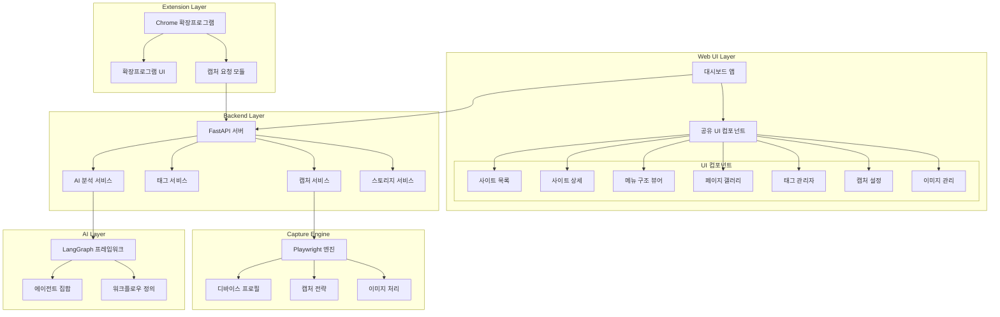

# 컴포넌트 아키텍처

```mermaid
graph TD
    subgraph "Web UI Layer"
        Dashboard[대시보드 앱]
        DashComponents[공유 UI 컴포넌트]
        Dashboard --> DashComponents

        subgraph "UI 컴포넌트"
            SiteList[사이트 목록]
            SiteDetail[사이트 상세]
            MenuViewer[메뉴 구조 뷰어]
            Gallery[페이지 갤러리]
            TagManager[태그 관리자]
            CaptureConfig[캡처 설정]
            ImageManager[이미지 관리]
        end

        DashComponents --> SiteList
        DashComponents --> SiteDetail
        DashComponents --> MenuViewer
        DashComponents --> Gallery
        DashComponents --> TagManager
        DashComponents --> CaptureConfig
        DashComponents --> ImageManager
    end

    subgraph "Extension Layer"
        ChromeExt[Chrome 확장프로그램]
        ExtUI[확장프로그램 UI]
        ExtCapture[캡처 요청 모듈]

        ChromeExt --> ExtUI
        ChromeExt --> ExtCapture
    end

    subgraph "Backend Layer"
        API[FastAPI 서버]
        CaptureService[캡처 서비스]
        TagService[태그 서비스]
        AIService[AI 분석 서비스]
        StorageService[스토리지 서비스]

        API --> CaptureService
        API --> TagService
        API --> AIService
        API --> StorageService
    end

    subgraph "Capture Engine"
        PlaywrightEngine[Playwright 엔진]
        DeviceProfiles[디바이스 프로필]
        CaptureStrategies[캡처 전략]
        ImageProcessing[이미지 처리]

        PlaywrightEngine --> DeviceProfiles
        PlaywrightEngine --> CaptureStrategies
        PlaywrightEngine --> ImageProcessing
    end

    subgraph "AI Layer"
        LangGraph[LangGraph 프레임워크]
        Agents[에이전트 집합]
        Workflows[워크플로우 정의]

        LangGraph --> Agents
        LangGraph --> Workflows
    end

    ExtCapture --> API
    Dashboard --> API
    CaptureService --> PlaywrightEngine
    AIService --> LangGraph
```
