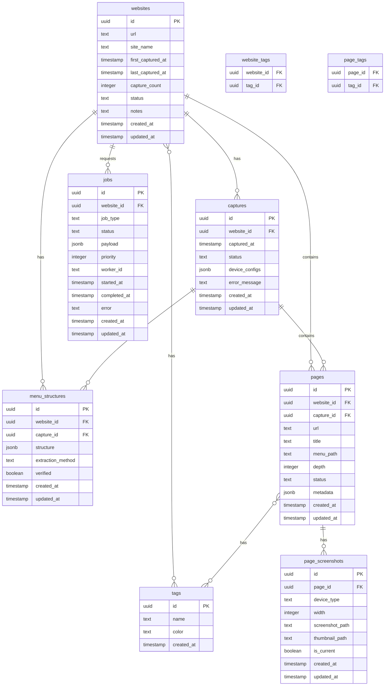

# 데이터베이스 ERD

```mermaid
erDiagram
    websites ||--o{ captures : has
    websites ||--o{ menu_structures : has
    websites ||--o{ pages : contains
    websites ||--o{ jobs : requests
    websites }o--o{ tags : has
    captures ||--o{ menu_structures : includes
    captures ||--o{ pages : contains
    pages }o--o{ tags : has
    pages ||--o{ page_screenshots : has

    websites {
        uuid id PK
        text url
        text site_name
        timestamp first_captured_at
        timestamp last_captured_at
        integer capture_count
        text status
        text notes
        timestamp created_at
        timestamp updated_at
    }

    captures {
        uuid id PK
        uuid website_id FK
        timestamp captured_at
        text status
        jsonb device_configs
        text error_message
        timestamp created_at
        timestamp updated_at
    }

    menu_structures {
        uuid id PK
        uuid website_id FK
        uuid capture_id FK
        jsonb structure
        text extraction_method
        boolean verified
        timestamp created_at
        timestamp updated_at
    }

    pages {
        uuid id PK
        uuid website_id FK
        uuid capture_id FK
        text url
        text title
        text menu_path
        integer depth
        text status
        jsonb metadata
        timestamp created_at
        timestamp updated_at
    }

    page_screenshots {
        uuid id PK
        uuid page_id FK
        text device_type
        integer width
        text screenshot_path
        text thumbnail_path
        boolean is_current
        timestamp created_at
        timestamp updated_at
    }

    jobs {
        uuid id PK
        uuid website_id FK
        text job_type
        text status
        jsonb payload
        integer priority
        text worker_id
        timestamp started_at
        timestamp completed_at
        text error
        timestamp created_at
        timestamp updated_at
    }

    tags {
        uuid id PK
        text name
        text color
        timestamp created_at
    }

    website_tags {
        uuid website_id FK
        uuid tag_id FK
    }

    page_tags {
        uuid page_id FK
        uuid tag_id FK
    }
```
