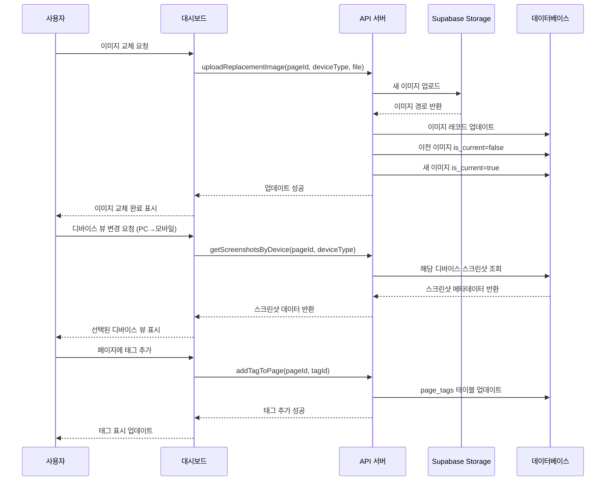

# 화면 관리 시퀀스 다이어그램

```mermaid
sequenceDiagram
    participant User as 사용자
    participant Dashboard as 대시보드
    participant API as API 서버
    participant Storage as Supabase Storage
    participant DB as 데이터베이스

    %% 이미지 교체 프로세스
    User->>Dashboard: 이미지 교체 요청
    Dashboard->>API: uploadReplacementImage(pageId, deviceType, file)
    API->>Storage: 새 이미지 업로드
    Storage-->>API: 이미지 경로 반환
    API->>DB: 이미지 레코드 업데이트
    API->>DB: 이전 이미지 is_current=false
    API->>DB: 새 이미지 is_current=true
    API-->>Dashboard: 업데이트 성공
    Dashboard-->>User: 이미지 교체 완료 표시

    %% 디바이스 뷰 전환
    User->>Dashboard: 디바이스 뷰 변경 요청 (PC→모바일)
    Dashboard->>API: getScreenshotsByDevice(pageId, deviceType)
    API->>DB: 해당 디바이스 스크린샷 조회
    DB-->>API: 스크린샷 메타데이터 반환
    API-->>Dashboard: 스크린샷 데이터 반환
    Dashboard-->>User: 선택된 디바이스 뷰 표시

    %% 태그 관리
    User->>Dashboard: 페이지에 태그 추가
    Dashboard->>API: addTagToPage(pageId, tagId)
    API->>DB: page_tags 테이블 업데이트
    API-->>Dashboard: 태그 추가 성공
    Dashboard-->>User: 태그 표시 업데이트
```
